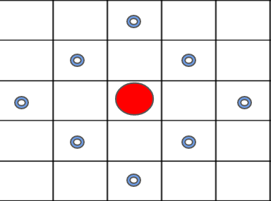
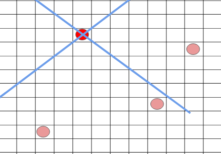
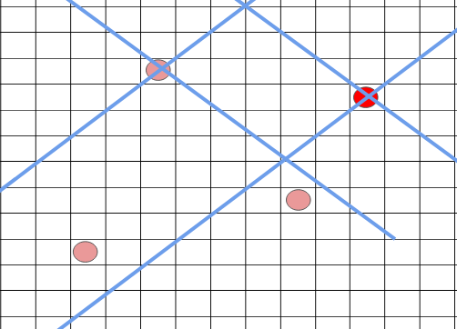
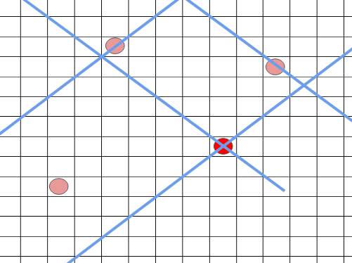
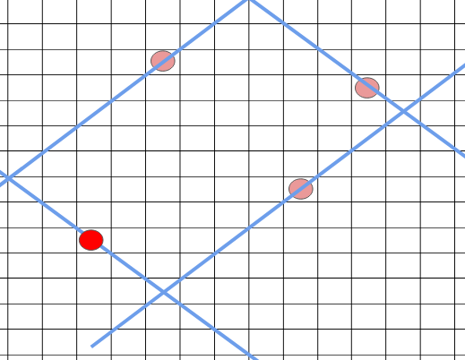

# Analysis

O(N^3): first BFS O(N^2), then try each cell as the one to add and see if the distance to every other cell can be lessened. Too costly.

O(N^2*log(N)): Binary search for the overall delivery time K, but must test in O(N^2) time. Do this by looking at all cells that go over K and noting that the final answer, if any, needs to include that.

## Strategy
Observation 1: At a certain point, all points with a Manhattan distance K away from it form a square tiled 45 degress (shown below).

Observation 2: Any point on a line on the grid with slope = 1 has a constant i + j (as i shrinks, j increases). Any point on a line on the grid with slope = -1 has a constant i - j (as i increases, j increases). 

We just need to track the four lines of the square. min/maxA = lowest / highest ascending line, min/maxD = lowest/highest descending line.
For any of the points >= K, we need to include them in the four lines, so update the mins with min(this point, min) and same for maxes. 

See the progression of the 4 lines as we iterate through the red points (points that need to be fixed). They grow / shrink to accomodate all points that must be accomodated.

Bright red = active

Finally, we go through every cell and judge its Manhattan distance from each of the four lines. If all of these distances are <= k, then adding a delivery center to this supports all cells.

Subsequent observation: The lower K is, the more points go over K and thus the farther apart the four lines must be. 