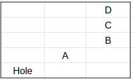
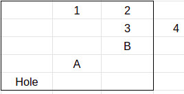
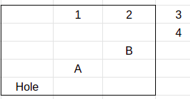
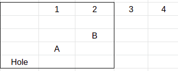

# Analysis

## Most people get the gist of it: 

- It's easier to use the diagonals stemming off from the lower left and upper
right corners of the hole because the robot must pass through exactly one of
these special cells if it wants to make it to the exit. 

- In m moves, there are 2^m different possible states (special case is addressed later).

- The probability of reaching a cell in which you need to move i cells down and
j cells right to get to it (total m moves) is mCi / 2^m = m!/(i! * (m-i)! *
2^m). This is because from m moves, you need to choose exactly i to move down.

- 2^log2(x) = x, and this helps with maintaining these large factorials.

### All said and done, right? No, because if you have an edge cell B, you are undercounting the number of ways you can get to that cell in m moves. The method described above, which can be used perfectly for most other cells, fails to account for the special rules: 

- once on the rightmost column, you can only move down 
- once on the bottommost row, you can only move right 

### There are 16 possible places you can end up in if you take 4 random moves. In 5 of them, you end up off the board even though you are not supposed to, based on the two special rules listed above. These are:

      

We must add back the probabilities of all these cases. How to do this? For any
cell above B, if the robot visited it on its path, there is an 100% chance
that it will reach B. For any of these, it can either go right or down:

1. If it goes down (50% of the time), that probability is calculated already by
   our calculation of the cell under it. So don't add this.
2. If it goes right (50% of the time), this is an invalid state by the special
   rules of the problem. We didn't count these when we should've.

So for C, D, and so on upwards, there is 100% chance you will reach B. But we
already accounted for 50% of the cases. We just need to account for the other
50% now. More technically, 